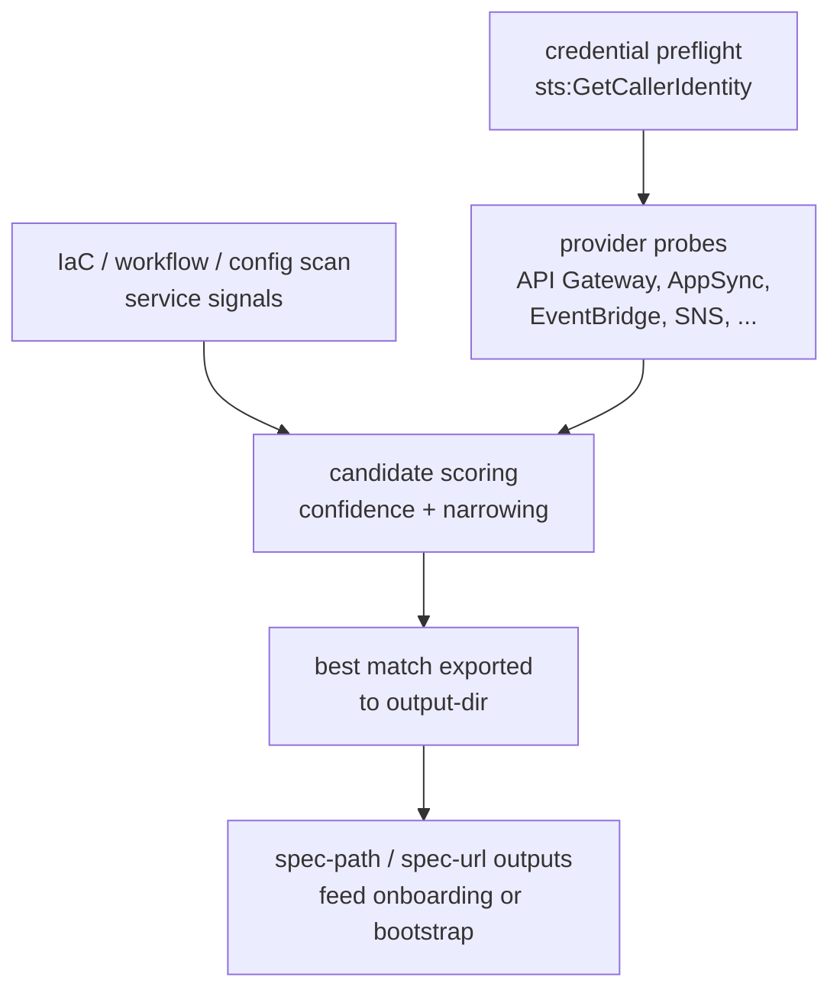

# Postman Onboarding: AWS Spec Discovery

[](https://github.com/postman-cs/postman-aws-spec-discovery-action/actions/workflows/ci.yml) [](https://github.com/postman-cs/postman-aws-spec-discovery-action/releases) [](https://www.npmjs.com/package/@postman-cse/onboarding-aws-spec-discovery) [](LICENSE)

Zero-config discovery and export of API specs from AWS services using only your existing AWS credentials. Use it when a service already runs on AWS and you need a source-of-truth [Spec Hub](https://learning.postman.com/docs/design-apis/specifications/overview/) specification that Postman onboarding can turn into deterministic collections, OpenAPI-backed contract checks, smoke tests, mocks, monitors, repo artifacts, and CI runs.

Part of the [Postman API Onboarding suite](https://github.com/postman-cs/postman-api-onboarding-action); the composite action's README has the full [action-picker table](https://github.com/postman-cs/postman-api-onboarding-action#which-action-should-i-use).

You usually set just `aws-region`. Repo identity comes from CI automatically, providers are auto-detected by probing your IAM permissions, and repo-first resolution prefers existing specs before calling AWS. No GitHub token is required by this action; it is read-only against AWS APIs.

- [Region and Postman handoff](#region-and-postman-handoff)
- [Usage](#usage)
- [Examples](#examples)
- [Inputs](#inputs) / [Outputs](#outputs)
- [Supported providers](#supported-providers)
- [How it works](#how-it-works)

## Region and Postman handoff

The first required choice is the AWS region. Set `aws-region` to the region that contains the API Gateway, AppSync, SNS, EventBridge, Lambda, SSM, or other provider resources you want to inspect. If the repo already contains a spec, the action can still resolve it before calling AWS, but AWS credentials must be valid because startup validates identity.

For the Postman side, use `postman-resolve-service-token-action` to mint the access token and team ID from a [Postman service account](https://learning.postman.com/docs/administration/service-accounts/) PMAK, then pass this action's `spec-path` output into the composite onboarding action for [spec import](https://learning.postman.com/docs/design-apis/specifications/import-a-specification/). If you call bootstrap directly for an org-mode workspace, use bootstrap's `workspace-team-id` input for workspace creation. Downstream Postman credential preflight accepts `warn` and `enforce`; do not configure a public opt-out.

## Usage

```yaml
jobs:
  onboard-from-aws:
    runs-on: ubuntu-latest
    permissions:
      id-token: write
      contents: write
      actions: write
    steps:
      - uses: actions/checkout@v7

      - uses: aws-actions/configure-aws-credentials@v6
        with:
          role-to-assume: arn:aws:iam::123456789012:role/postman-spec-discovery
          aws-region: us-east-1

      - id: postman_token
        uses: postman-cs/postman-resolve-service-token-action@v2
        with:
          postman-api-key: ${{ secrets.POSTMAN_SERVICE_ACCOUNT_API_KEY }}
          postman-region: us

      - id: resolve
        uses: postman-cs/postman-aws-spec-discovery-action@v3
        with:
          aws-region: us-east-1

      - uses: postman-cs/postman-api-onboarding-action@v2
        if: steps.resolve.outputs.resolution-status == 'resolved'
        with:
          postman-api-key: ${{ secrets.POSTMAN_SERVICE_ACCOUNT_API_KEY }}
          postman-access-token: ${{ steps.postman_token.outputs.token }}
          postman-team-id: ${{ steps.postman_token.outputs.team-id }}
          postman-region: us
          credential-preflight: warn
          project-name: ${{ steps.resolve.outputs.service-name }}
          spec-path: ${{ steps.resolve.outputs.spec-path }}
```

The resolved spec lands in `discovered-specs/` and the step exposes `spec-path`, `service-name`, confidence, and provenance as outputs.

The `id-token: write` permission is for AWS OIDC role assumption through `aws-actions/configure-aws-credentials`. `contents: write` and `actions: write` match the downstream composite action's default artifact commit and generated-workflow behavior. This AWS discovery action itself does not write repository contents or request a GitHub token. See [docs/providers.md](docs/providers.md#security-and-iam) for the minimum and full IAM policies.

For EU Postman data residency, set `postman-region: eu` on both the service-token and downstream Postman action steps.

## Examples

### Zero-config, region only

Providers are probed against your IAM permissions; anything your role cannot read is skipped for resolution and recorded as a typed probe denial in provenance.

```yaml
- id: resolve
  uses: postman-cs/postman-aws-spec-discovery-action@v3
  with:
    aws-region: us-east-1
```

### Known API Gateway ID

Bypass broad account discovery when you already know the gateway.

```yaml
- id: resolve
  uses: postman-cs/postman-aws-spec-discovery-action@v3
  with:
    aws-region: us-east-1
    gateway-id: abc123def4
```

### discover-many mode

Export specs from all discovered APIs across all available providers. `mode` is an environment-variable input (`INPUT_MODE`).

```yaml
- id: discover
  uses: postman-cs/postman-aws-spec-discovery-action@v3
  env:
    INPUT_MODE: discover-many
  with:
    aws-region: us-east-1
```

### Custom output directory

Write generated specs somewhere other than `discovered-specs/`. The path must resolve within the repository root.

```yaml
- id: resolve
  uses: postman-cs/postman-aws-spec-discovery-action@v3
  with:
    aws-region: us-east-1
    output-dir: postman/specs
```

### Chaining into Postman API onboarding

Feed the discovered spec straight into the [onboarding composite](https://github.com/postman-cs/postman-api-onboarding-action) via its `spec-path` input. The service-token action is the primary way to supply the Postman access token and team ID.

```yaml
- id: postman_token
  uses: postman-cs/postman-resolve-service-token-action@v2
  with:
    postman-api-key: ${{ secrets.POSTMAN_SERVICE_ACCOUNT_API_KEY }}
    postman-region: us

- id: resolve
  uses: postman-cs/postman-aws-spec-discovery-action@v3
  with:
    aws-region: us-east-1

- uses: postman-cs/postman-api-onboarding-action@v2
  if: steps.resolve.outputs.resolution-status == 'resolved'
  with:
    postman-api-key: ${{ secrets.POSTMAN_SERVICE_ACCOUNT_API_KEY }}
    postman-access-token: ${{ steps.postman_token.outputs.token }}
    postman-team-id: ${{ steps.postman_token.outputs.team-id }}
    postman-region: us
    credential-preflight: warn
    project-name: ${{ steps.resolve.outputs.service-name }}
    spec-path: ${{ steps.resolve.outputs.spec-path }}
```

### Chaining directly into workspace bootstrap

Use the bootstrap action directly when you only need workspace/spec/collection creation and do not want repo sync or Insights linking. For org-mode workspace creation, provide bootstrap's `workspace-team-id` from your configured Postman sub-team.

```yaml
- id: postman_token
  uses: postman-cs/postman-resolve-service-token-action@v2
  with:
    postman-api-key: ${{ secrets.POSTMAN_SERVICE_ACCOUNT_API_KEY }}
    postman-region: us

- id: resolve
  uses: postman-cs/postman-aws-spec-discovery-action@v3
  with:
    aws-region: us-east-1

- uses: postman-cs/postman-bootstrap-action@v2
  if: steps.resolve.outputs.resolution-status == 'resolved'
  with:
    postman-api-key: ${{ secrets.POSTMAN_SERVICE_ACCOUNT_API_KEY }}
    postman-access-token: ${{ steps.postman_token.outputs.token }}
    workspace-team-id: ${{ vars.POSTMAN_WORKSPACE_TEAM_ID }}
    postman-region: us
    credential-preflight: enforce
    project-name: ${{ steps.resolve.outputs.service-name }}
    spec-path: ${{ steps.resolve.outputs.spec-path }}
```

### Event-driven repos (SNS contracts)

For event-driven repositories using SNS, keep your contract in-repo as AsyncAPI or JSON Schema and let the action resolve it automatically. The action detects SNS usage from IaC files and resolves durable event contracts instead of exporting an AWS-generated spec.

```yaml
- id: resolve-events
  uses: postman-cs/postman-aws-spec-discovery-action@v3
  env:
    INPUT_MODE: resolve-one
    INPUT_EXPECTED_SERVICE_NAME: orders-events
  with:
    aws-region: us-east-1
```

See [docs/sns-contract-resolution.md](docs/sns-contract-resolution.md) for the full precedence chain, sidecars, and edge cases.

### GitLab and other CI (portable CLI)

```bash
node dist/cli.cjs \
  --aws-region us-east-1 \
  --repo-root "$CI_PROJECT_DIR" \
  --result-json "$CI_PROJECT_DIR/postman-aws-spec-discovery-result.json" \
  --dotenv-path "$CI_PROJECT_DIR/postman-aws-spec-discovery.env"
```

CLI environment-variable outputs are documented in [docs/providers.md](docs/providers.md#cli-usage-gitlab-bitbucket-azure-devops).

## Inputs

<!-- inputs-table:start -->
| Name | Description | Required | Default |
| --- | --- | --- | --- |
| `aws-region` | AWS region used to resolve API Gateway, AppSync, SNS, EventBridge, Lambda, and other discovery providers. | yes | n/a |
| `gateway-id` | Optional known API Gateway ID for this service. Use this when you want to bypass broader account discovery. | no | n/a |
| `stage` | Optional API Gateway stage override (for example prod or staging). | no | n/a |
| `expected-account-id` | Optional AWS account ID that must match sts:GetCallerIdentity before export. Mismatch fails closed with a sanitized error. | no | n/a |
| `expected-partition` | Optional AWS partition (aws, aws-us-gov, or aws-cn) that must match the caller identity ARN before export. Mismatch fails closed with a sanitized error. | no | n/a |
| `expected-region` | Optional AWS region that must exactly match aws-region before discovery or export. Mismatch fails closed. | no | n/a |
| `spec-path` | Optional explicit path to a repository specification relative to repo-root. When set, resolution uses this contract and skips same-tier auto-selection. | no | n/a |
| `service-root` | Optional monorepo service root relative to repo-root. Scopes Backstage entities and repository contract inventory to that directory. | no | n/a |
| `remote-fetch-allowlist-json` | Optional JSON array of exact remote-fetch allowlist entries ({"hostname","pathPrefix"} or {"host","path"}). Absent or empty denies all remote spec fetches (Backstage, SSM, SNS). | no | n/a |
| `terraform-state-paths-json` | Optional JSON array of repo-relative local Terraform state/output artifact paths (for example terraform.tfstate). Default []. .tfstate is never auto-discovered; only listed paths are read. Remote Terraform state remains forbidden. | no | `[]` |
| `output-dir` | Directory under the repository root where generated specs are written. | no | `discovered-specs` |
| `postman-api-key` | Optional service-account PMAK used to mint or re-mint a postman-access-token for telemetry enrichment (account_type). Not used for any AWS or Postman asset operation. | no | n/a |
| `postman-access-token` | Optional Postman service-account access token, used only to enrich anonymous telemetry with the session account_type. When omitted, postman-api-key alone can mint one for the same purpose. Not used for any AWS or Postman asset operation. | no | n/a |
<!-- inputs-table:end -->

Optional resolution tuning inputs (`mode`, `expected-service-name`, `api-filter`, `max-candidates`, repo context overrides, and more) are set via `INPUT_`-prefixed environment variables and documented in [docs/providers.md](docs/providers.md#resolution-tuning-inputs).

## Outputs

<!-- outputs-table:start -->
| Name | Description |
| --- | --- |
| `resolution-json` | JSON resolution result describing status, source type, confidence, and evidence. |
| `resolution-status` | Resolution status: resolved or unresolved. |
| `source-type` | Resolved source type: repo-spec, gateway-export, appsync-schema, appsync-event-api, eventbridge-schema, eventbridge-surface, cfn-embedded, glue-schema, bedrock-action-group, alb-listener-rule, sns-contract, ssm-registry, lambda-url-export, lambda-event-source, verified-permissions-schema, step-functions-asl, manual-review, or discover-many. |
| `mapping-confidence` | Numeric confidence score for selected service candidate. |
| `spec-path` | Path to resolved or generated specification when available. |
| `gateway-id` | Resolved API Gateway ID when available. |
| `service-name` | Resolved service name. |
| `services-json` | Legacy discover-many output: JSON array of exported services. |
| `service-count` | Legacy discover-many output: number of exported services. |
| `export-summary-json` | discover-many summary JSON with attempted/exported/failed/skipped counts. |
| `candidates-json` | JSON array of top candidates when resolution is ambiguous. |
| `provider-type` | Provider that resolved the spec: api-gateway, appsync, appsync-events, eventbridge-schemas, eventbridge, cloudformation, glue, bedrock-action-group, alb-listener-rule, sns, ssm, lambda-url, lambda-event-source, verified-permissions, or step-functions. |
| `spec-format` | Format of the resolved spec: openapi-yaml, openapi-json, graphql-sdl, graphql-introspection-json, asyncapi-yaml, asyncapi-json, json-schema, postman-collection, smithy, avro, protobuf, wsdl, or mcp-json. |
| `contract-origin` | SNS contract provenance when available: repo-asyncapi, repo-json-schema, generated-asyncapi, ssm-content, ssm-url, catalog-url, eventbridge-derived, code-derived, or manual-review. |
| `contract-metadata-path` | Path to SNS resolution metadata sidecar when available. |
| `variant-count` | Number of SNS delivery variants discovered when available. |
| `derived-openapi-path` | Path to the canonical derived OpenAPI JSON sidecar when available. |
| `derived-openapi-version` | OpenAPI version of the derived sidecar when available. |
| `derived-openapi-completeness` | Derived OpenAPI completeness: full or partial. |
| `derived-openapi-format` | Format of the derived OpenAPI sidecar, currently openapi-json. |
| `derived-openapi-evidence-json` | JSON array of evidence entries explaining derived OpenAPI quality and limitations. |
| `narrowing-strategy` | Progressive narrowing tier applied to API Gateway candidates (iac-fingerprint, cfn-correlation, tag-prefilter, naming-heuristic), or none when no tier matched. |
<!-- outputs-table:end -->

## Supported providers

| Provider | Artifact | Auto-detected via |
| --- | --- | --- |
| Repo-local specs | OpenAPI, Swagger, GraphQL SDL, AsyncAPI, Postman, JSON Schema, Avro, protobuf, Smithy | Known spec paths |
| Backstage catalog | Local or remote `catalog-info.yaml` API definitions | Root or nested catalog file |
| API Gateway (REST, HTTP, WebSocket) | OpenAPI 3.0 export or synthesis | IAM probe / explicit gateway ID |
| AppSync GraphQL | GraphQL SDL | IAM probe + `.graphql` files |
| AppSync Events | Event API channel namespaces | IAM probe |
| EventBridge Schema Registry | JSON Schema or OpenApi3 content | IAM probe + IaC references |
| EventBridge rules, pipes, API destinations | Event patterns, filters, targets | IAM probe |
| CloudFormation embedded specs | Embedded or referenced OpenAPI body | IAM probe |
| Glue Schema Registry | Avro, JSON Schema, or protobuf | IAM probe + IaC references |
| Bedrock Agent action groups | Inline or S3 OpenAPI action group schema | IAM probe |
| ALB listener rules | Host/path/method/header/query conditions | IAM probe |
| SSM Parameter Store | Stored content, fetched URL content, or pointer | IAM probe for `/postman/specs/` |
| SNS topics | AsyncAPI / JSON Schema contracts plus sidecars | IAM probe + SNS IaC references + SSM fallback |
| Lambda Function URLs | Synthesized function URL contract | IAM probe + IaC references / URL pattern |
| Lambda event source mappings | Mapping filters, source, target, batch settings | IAM probe |
| Verified Permissions schemas | Cedar schema metadata | IAM probe |
| Step Functions ASL | State machine definitions | IAM probe |

Each provider is probed at startup; providers your role cannot read are skipped for resolution and recorded in `providerProbes`. Remote spec URLs are deny-by-default unless `remote-fetch-allowlist-json` exactly allowlists them. Per-provider artifacts, OpenAPI derivation, stage/tag contracts, and IAM policies are detailed in [docs/providers.md](docs/providers.md). The enforceable support matrix is [`validation/SUPPORT_LEDGER.md`](validation/SUPPORT_LEDGER.md).

## How it works



At startup the action validates credentials with `sts:GetCallerIdentity` (and optional `expected-account-id` / `expected-partition` fail-closed checks), probes each provider with a lightweight IAM read, and scans bounded IaC, workflow, and config files for service signals. Authored repository contracts (including JSON Schema, Avro, Smithy project closures, and GraphQL groups) win when unambiguous; use `spec-path` or `service-root` for monorepos. Exact repository tag correlation prefers `postman:repo`, then Fox `GithubOrg`+`GithubRepo`, before naming heuristics. Static IaC extraction never executes build tools. Remote fetches are deny-by-default. Stage selection is evidence-safe and records `deployed-stage` versus `latest-configuration`. Ambiguous runs emit ranked `candidates-json` / `manual-review` rather than silent first-wins. Full details live in [docs/providers.md](docs/providers.md); coverage is enforced by [validation/SUPPORT_LEDGER.md](validation/SUPPORT_LEDGER.md).

SNS is handled as a contract resolver, since SNS has no native exportable spec. Contracts resolve through a 9-level precedence chain (repo-local AsyncAPI down to manual review), with subscription-aware enrichment and metadata/webhook sidecars. See [docs/sns-contract-resolution.md](docs/sns-contract-resolution.md).

## Resources

- Support: [SUPPORT.md](SUPPORT.md); security reporting and credential guidance: [SECURITY.md](SECURITY.md); release and tag policy: [RELEASE_POLICY.md](RELEASE_POLICY.md)
- npm package: [@postman-cse/onboarding-aws-spec-discovery](https://www.npmjs.com/package/@postman-cse/onboarding-aws-spec-discovery)
- Docs in this repo: [provider deep dive](docs/providers.md), [SNS contract resolution](docs/sns-contract-resolution.md), [live testing runbook](docs/LIVE_TESTING_RUNBOOK.md), [validation suite](validation/README.md)
- Postman Learning Center: [Spec Hub](https://learning.postman.com/docs/design-apis/specifications/overview/), [import a specification](https://learning.postman.com/docs/design-apis/specifications/import-a-specification/), [cloud connectors](https://learning.postman.com/docs/api-catalog/connect/cloud/)

## Telemetry

The action sends one anonymous usage event per run (action name/version, outcome, coarse CI metadata; never secrets, spec content, or repo names). Discovery itself performs no Postman operation, so the event stays inert unless a `POSTMAN_TEAM_ID` environment variable attributes the run to a team; the optional `postman-api-key` / `postman-access-token` inputs only resolve the session `account_type` and never touch discovery. Disable with `POSTMAN_ACTIONS_TELEMETRY=off` or `DO_NOT_TRACK=1`; route events to your own collector with `POSTMAN_ACTIONS_TELEMETRY_ENDPOINT`.

## License

[MIT](LICENSE)
